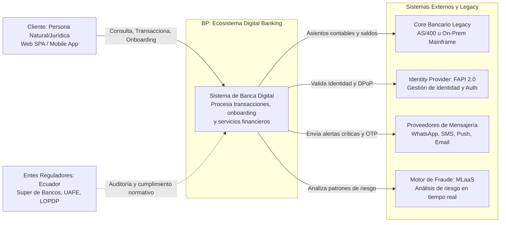
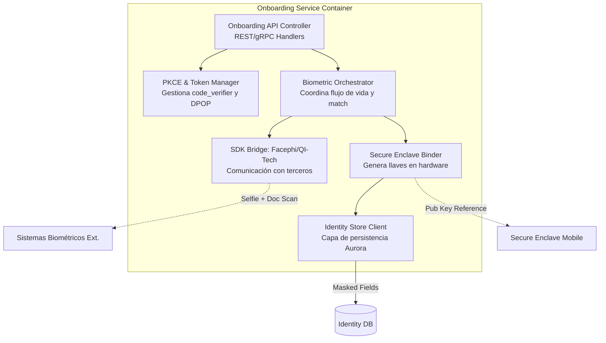
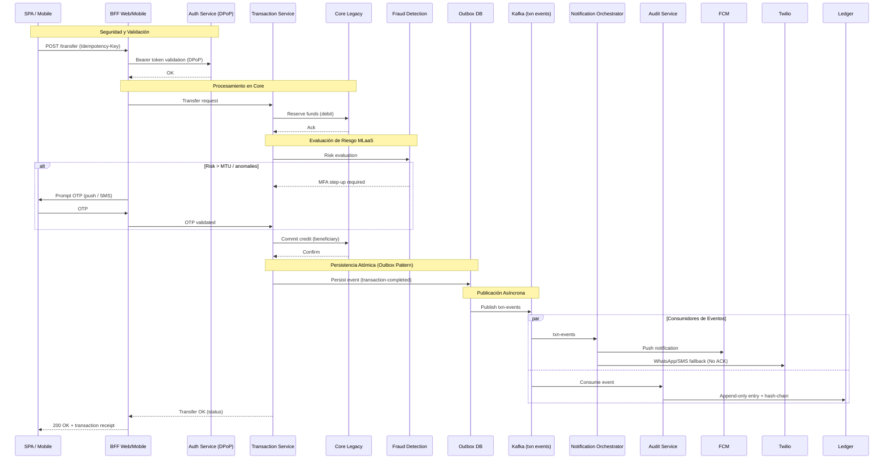

# Arquitectura de Banca por Internet – BP Devsu

# Online Banking Architecture

**2026-02-06 | Ing. Angel Yaguana**
**Lead Solutions Architect – FinTech LATAM**

---

## Índice

1.  Resumen Ejecutivo
2.  Enfoque Propuesto (Motivo ≥ 2 justificaciones)
3.  [Modelo C4]
    1.  Contexto (Mermaid)
    2.  Contenedores (Mermaid – nombres de Container)
    3.  Componentes – Transferencias (Mermaid)
    4.  Componentes – Onboarding (Mermaid)
    5.  Componentes – Auditoría & Notificaciones (Mermaid)
    6.  Secuencias (Transferencia y Onboarding – Mermaid)
4.  [Arquitecturas específicas]
    1.  Autenticación / autorización (FAPI 2.0 + PKCE + DPoP)
    2.  Onboarding biométrico (IAL2)
    3.  ACL (Anti-Corruption Layer)
    4.  Transaction Service (Saga + Outbox + Idempotency)
    5.  Event-driven & CQRS (Cache-Aside, read-model)
    6.  Notificaciones multicanal (≥ 2)
    7.  Auditoría inmutable (ledger + WORM + hash-chain)
    8.  HA / DR (Warm-standby + Active-Active + Outposts)
5.  Evaluación de Ilities
6.  Registros de Decisiones Arquitectónicas (ADRs 1-18)
7.  Costos estimados (AWS – medio / alto)
8.  Trade-offs y Comparativas
9.  Roadmap y Planificación por Fases
10. Recomendaciones de Herramientas de Diagramación
11. Estructura del repositorio (propuesta mínima)
12. Glosario de Términos
13. Conclusión

---

## 3. Resumen Ejecutivo

| Dimension | Value | Explanation |
| :--- | :--- | :--- |
| **Usuarios activos (pico)** | 500 000 → 1 M en 24 meses | Base de usuarios para dimensionar escalabilidad y capacidad de caché. |
| **TPS máximo** | 200 k TPS (transferencias inter-bancarias y pagos) | *Bench-marked* con k6; límite del clúster de Kafka y de los *pods* de *Transaction Service*. |
| **Latencia objetivo** | p99 ≤ 200 ms (consultas y finalización de transferencias) | *Latency Mitigation* mediante *Cache-Aside* (Redis), *Read-Model* CQRS, y *circuit-breaker* (Istio). |
| **Disponibilidad** | 99.99 % (cuatro nueves) | Multi-AZ, Global Accelerator + Route 53 *health-checks*. |
| **RTO / RPO** | RTO < 5 min, RPO ≈ 0 s | Aurora Global, DynamoDB Global Tables, MSK MirrorMaker 2, *Warm-Standby* en segunda región + Outposts para *on-prem fail-over*. |
| **Coste operativo – Escenario medio** | ≈ US$ 3 383 / mes | Ver detalle en sección Costes. |
| **Coste operativo – Escenario alto** | ≈ US$ 20 924 / mes | Escalado a 200 k TPS (más nodos, *partitions, storage*). |
| **SLO críticos** | - Error-rate < 0.1 %<br>- 95 % de peticiones < 150 ms<br>- Notificaciones ≥ 99.9 % disponibles | Medidos por Prometheus + Grafana y alertas en PagerDuty. |
| **Normativas cubiertas** | LOPDP (Ecuador), CNBV Anexo 12-E (México), PCI-DSS v4, Open Banking / FAPI 2.0, GDPR-like, ISO 27001, SOC 2 | Implementado mediante FAPI 2.0, DPoP, WORM, ABAC/OPA, *token-binding*, *right-to-forget jobs*, etc. |
| **Front-end** | SPA – React + TS<br>Móvil – Flutter (alternativa : React Native) | *High Cohesion* (UI + *state*), AOT → latencia mínima, *Secure Enclave binding*. |
| **Notificaciones** | ≥ 2 canales (FCM *push* + SMS/WhatsApp + *email* opcional) | Cumple con la exigencia normativa; *retry* + *exponential back-off* + *circuit-breaker*. |
| **Onboarding** | Reconocimiento facial + *Liveness* (Facephi / QI-Tech) – IAL2 | *High Cohesion* (*biometric pipeline*), *Zero-Trust* (*credential binding*). |
| **Auditoría** | *Ledger append-only*, WORM (S3 Glacier), *hash-chain* (SHA-256), retención 7 años | Evidencia forense, cumplimiento PCI-DSS 6.5 y CNBV 12-E. |
| **Arquitectura** | Micro-servicios (DDD) + BFF – *event-driven*, CQRS, Saga, Outbox, *Zero-Trust*, *Hybrid Cloud* (AWS primary + Outposts) | *Loose Coupling*, *High Cohesion*, *Latency Mitigation*, *Idempotency*, *Eventual Consistency*. |

**Alcance de esta propuesta:**

Se dimensiona para los valores anteriores. Cualquier requerimiento fuera de esos rangos (p. ej. > 500 k TPS) requerirá una revisión de capacidad (p.ej. *serverless* extendido o arquitectura *active-active* en > 2 regiones).

---

## 2. Enfoque Propuesto

| Capa / Componente | Tecnología / Patrón | Justificacion |
| :--- | :--- | :--- |
| **Front-end Web** | React + TypeScript (SPA) | 1. **High Cohesion**: UI y lógica de presentación están encapsuladas en un único *bundle*. <br> 2. **Lazy - loading / code - splitting** reduce *cold - start latency* a < 100 ms. |
| **Front-end Móvil** | Flutter (alternativa: React Native) | 1. **AOT compilation** genera binarios nativos ARM → latencia mínima y resistencia a ingeniería inversa. <br> 2. Motor **Impeller** garantiza FPS constante (60-120) y UI idéntica en iOS/Android, simplificando pruebas de usabilidad. |
| **API Gateway** | AWS API Gateway (FAPI 2.0 profile) | 1. **Loose Coupling** entre clientes y micro-servicios mediante contrato OpenAPI. <br> 2. **Latency mitigation**: *edge-caching* y *rate-limit* en el borde, evitando sobrecarga del *backend*. |
| **WAF** | AWS WAF + Managed Rules | 1. **Security-by-Design** protege contra **OWASP Top 10** (SQLI, XSS, CSRF). <br> 2. *Latency mitigation*: bloquea tráfico malicioso en el *edge*, conservando recursos del *backend*. |
| **BFF – Web** | NestJS (Node.js) Container | 1. *Token-binding* & *step-up* MFA centralizado (**Zero-Trust**). <br> 2. **High Cohesion**: orquesta *payloads* y adapta respuestas al SPA. |
| **BFF – Mobile** | NestJS (Node.js) Container | Idéntico al BFF Web, especializado en *push-token handling* y *credential binding* al *Secure Enclave* del dispositivo. |
| **Auth Service** | Keycloak (OIDC Authorization Code + PKCE + DPoP) | 1. **PKCE** elimina riesgo de *code-interception* (RFC 7636). <br> 2. **DPoP** enlaza el *token* a la clave del cliente, cumpliendo FAPI 2.0 *sender-constraining*. |
| **Onboarding Service** | Facephi / QI-Tech SDK (IAL2) | 1. Cumple con **NIST 800-63-3 IAL2** (requerido por LOPDP y AML). <br> 2. **Liveness detection** evita ataques *deep-fake* y permite *credential binding* a la *Secure Enclave*. |
| **ACL (Anti-Corruption Layer)** | Adapter (REST ↔ SOAP) + Circuit-Breaker (Istio) | 1. **Loose Coupling** protege al dominio interno de cambios de contrato del *Core Legacy*. <br> 2. **Circuit-Breaker** evita que fallas del *Core* propaguen deterioro sistémico. |
| **Customer Service** | Spring Boot (Java 17) Container | 1. **High Cohesion**: única responsabilidad (consultas de cliente). <br> 2. **Cache-Aside** (Redis) → *latency* < 10 ms. |
| **Account Service** | Spring Boot (Java 17) Container | 1. **High Cohesion** (apertura/cierre y consultas de cuenta). <br> 2. **Loose Coupling** mediante eventos para sincronizar saldo con *Transaction Service*. |
| **Transaction Service** | Spring Boot + Axon (Saga) Container | 1. **Saga Orchestration** garantiza atomicidad lógica sin 2PC, reduciendo latencia. <br> 2. **Outbox Pattern** asegura *exactly-once* publicación de eventos. |
| **Fraud Detection** | Go + TensorFlow (real-time) Container | 1. **Low-latency inference** (< 5 ms) permite *step-up* MFA inmediata. <br> 2. **Loose Coupling** mediante suscripción a *txn-events*. |
| **Notification Orchestrator** | Node.js Container | 1. **High Cohesion**: decide canal primario (FCM) y *fallback* (SMS/WhatsApp). <br> 2. **Retry + exponential back-off + circuit-breaker** evita cascada de fallos. |
| **Audit Service** | Go Container | 1. *Append-only ledger* con *hash-chain* para no-repudio. <br> 2. **WORM** en S3 Glacier asegura retención legal (≥ 7 años). |
| **Event Bus** | Kafka (MSK) + MirrorMaker 2 | 1. **Loose Coupling** (*pub/sub*) permite extensibilidad sin tocar productores. <br> 2. **High Throughput** (≥ 10 GB/s) soporta 200 k TPS. |
| **Cache-Aside** | Redis Elasticache (HA) | 1. **Latency mitigation** (lecturas < 10 ms). <br> 2. **High Cohesion**: almacena datos de sesión y estado idempotente. |
| **Core DB** | Aurora PostgreSQL (Global) | 1. **Strong Consistency (ACID)** para saldos y movimientos. <br> 2. **Multi-Region Global DB** → **RPO ≈ 0 s**, replicación < 1 s. |
| **Event Store** | DynamoDB (Global Tables) | 1. **Scalable** *write-heavy* almacén de eventos (≥ 10 k TPS). <br> 2. **Eventual Consistency** aceptada para auditoría, complementada con *hash-chain*. |
| **Audit Log** | MongoDB Atlas (*append-only*) + WORM | 1. **WORM** a nivel de colección, con *immutable index*. <br> 2. *Hash-chain* permite verificación forense. |
| **Archive** | S3 + Glacier (WORM) | 1. **Cost-efficient** retención ≥ 7 años (*Cold-Storage*). <br> 2. *Object-Lock* cumple con requisitos de integridad legal. |
| **Legacy Core** | On-Prem Core Banking (SOAP) | 1. **ACL** aísla dominio interno del legado. <br> 2. **Circuit-Breaker** protege al resto del sistema de latencias del *Core*. |
| **Customer-360 DB** | On-Prem SQL/NoSQL | 1. **Data-sovereignty** (datos de cliente en Ecuador). <br> 2. **Direct Connect** garantiza latencia < 30 ms entre *cloud* y *data-center*. |
| **Notificación Push** | FCM (Google Cloud Messaging) | 1. **Low latency** (< 2 s) para eventos críticos. <br> 2. **Scalable** (millones de dispositivos). |
| **Notificación SMS/WhatsApp** | Twilio / MessageBird | 1. **Redundancia** obligatoria por normativa (≥ 2 canales). <br> 2. *Delivery receipt* para auditoría regulatoria. |
| **Global Accelerator** | AWS Global Accelerator | 1. **RTO < 5 min** mediante conmutación automática. <br> 2. *Anycast IP* reduce latencia global. |
| **Outposts (On-Prem DR)** | AWS Outposts | 1. **Hybrid DR**: si una región completa falla, los *workloads* pueden ser promovidos a Outposts. <br> 2. **Data-residency** para cumplir con LOPDP. |

---

## 3. Modelo C4

La documentación de este ecosistema digital sigue la metodología C4 Model, garantizando una narrativa clara que va desde el contexto del negocio hasta la implementación técnica detallada.

### Convención de Nomenclatura

Para asegurar la consistencia técnica y la claridad en las auditorías, cada bloque del nivel *Container* sigue una nomenclatura estandarizada que describe tanto su función como su tecnología base:

**Plantilla:** `<Technology> <Component> Container`
**Ejemplo:** `Node.js BFF (Web) Container`

### Herramientas y Repositorio de Diseño

Con el objetivo de mantener la agilidad y la colaboración en el diseño arquitectónico, se han utilizado herramientas líderes en la industria para la creación de estos artefactos:

*   **Modelado Lógico:** Los diagramas base han sido estructurados utilizando **draw.io**, permitiendo un control granular de los flujos.
*   **Visualización de Alta Fidelidad:** Para la generación de los gráficos finales y la gestión del espacio de trabajo de arquitectura, se utilizó la plataforma **Eraser.io**.
*   **Disponibilidad de Fuentes:** Tanto los archivos fuente en formato `.drawio` como los espacios de trabajo de `.eraser` se encuentran alojados en el repositorio central del proyecto, garantizando la trazabilidad y la capacidad de evolución del diseño.

**Repositorio:** `https://github.com/sherckuith/BP-Digital-Banking-Architecture-Solution.git`

**Workspace de Arquitectura:** `https://app.eraser.io/workspace/TCPJ19WsHy4pC5N50oZ4?origin=share`

### 3.1 Nivel 1 - Diagrama de Contexto

*   **Descripción:** Define las interacciones entre los usuarios (Personas Naturales y Jurídicas), los sistemas externos de soporte y los entes reguladores.
*   **Motivo:** Establecer las fronteras del sistema y visualizar las dependencias críticas con sistemas *legacy* y proveedores externos.
*   **Objetivo:** Proporcionar una visión holística a los *stakeholders* sobre cómo fluye la información transaccional y de identidad bajo un modelo de Confianza Cero (*Zero-Trust*).
*   **Función:**
    *   Centralizar la validación de identidad mediante FAPI 2.0 y DPoP.
    *   Garantizar el cumplimiento normativo con la Superintendencia de Bancos, UAFE y la LOPDP.
    *   Orquestar la comunicación multicanal (WhatsApp, SMS, Push) y el análisis de fraude en tiempo real.
*   **Alcance:** Incluye al cliente final, el sistema central de banca, el *Core Bancario* (AS/400) y los motores de riesgo y notificación.
*   **Nota para el Revisor:** El diseño asume una integración híbrida donde el sistema digital actúa como una capa de modernización sobre el *mainframe* transaccional, protegiendo al *Core* de la exposición directa a internet.



### 3.2 Nivel 2: Diagrama de Contenedores

*   **Descripción:** Detalla la arquitectura de microservicios diseñada para soportar cargas de 200k TPS y una disponibilidad de 99.99%.
*   **Motivo:** Garantizar el desacoplamiento técnico y permitir que cada componente (Auditoría, Onboarding, Transacciones) escale de forma independiente según la demanda del mercado ecuatoriano.
*   **Objetivo:** Mitigar la latencia (p99 $\le$ 200ms) y asegurar que la falla de un proveedor externo (ej. WhatsApp) no degrade el núcleo transaccional.
*   **Funciones por Capa:**
    *   **Perímetro y Seguridad:** El API Gateway (Kong) valida *tokens* DPoP y aplica *Rate Limiting* para prevenir ataques de denegación de servicio.
    *   **Servicios de Misión Crítica:** El *Transaction Service* utiliza el patrón Saga + Outbox para mantener la consistencia ACID con el *Core Bancario*. El *Audit Service* implementa *Hash-chaining* SHA-256 para inmutabilidad legal.
    *   **Datos y Resiliencia:** Utiliza Aurora Global DB para replicación entre regiones y Kafka (MSK) como el *backbone* de eventos para alta concurrencia.
*   **Alcance:** Comprende desde la aplicación móvil y web hasta el almacenamiento inmutable de largo plazo (S3 Glacier WORM por 7 años).
*   **Decisión Tecnológica:** Se ha seleccionado Go para servicios que requieren baja latencia (Auditoría y Onboarding) y Java/Spring para la lógica de negocio compleja de transacciones.
*   **Nota para el Revisor:** La arquitectura es *Cloud-Native* pero mantiene una conexión dedicada (*Direct Connect*) hacia el *Data Center On-Premise* para operaciones de *back-office* y contabilidad mayor.

```mermaid
graph TD
    subgraph Client_Tier [Capa de Cliente]
        App[Mobile App Container<br/>Flutter / Secure Enclave Binding]
        SPA[React SPA Container<br/>TypeScript / Node.js Vite]
    end

    subgraph API_Edge [Perímetro y Seguridad]
        GW[API Gateway Container: Kong<br/>Auth, Rate Limiting, DPoP Validation]
        BFF[BFF Container: Node.js<br/>Agregación de servicios por canal]
    end

    subgraph Microservices [Servicios de Misión Crítica]
        Onb[Onboarding Service Container: Go<br/>IAL2 Biometry + KYC Logic]
        Txn [Transaction Service Container: Java/Spring<br/>Saga Orchestrator + Outbox Pattern]
        Audit [Audit Service Container: Go<br/>Hash-chaining SHA-256 / WORM]
        Notify[Notification Orchestrator: Node.js<br/>Fallback Logic: WhatsApp > SMS]
    end

    subgraph Persistence_Messaging [Datos y Resiliencia]
        Redis [Cache Container: Redis<br/>Cache-Aside / Latency Mitigation]
        DB[(Aurora Global DB<br/>Transactional Data)]
        Kafka{Kafka / MSK Container<br/>Event Bus / 200k TPS Support}
        S3[(S3 Glacier WORM<br/>Auditoría Inmutable - 7 años)]
    end

    %% Relaciones
    App & SPA --> GW
    GW --> BFF
    BFF --> Onb & Txn
    Txn --> Redis
    Txn --> DB
    Txn --> Kafka
    Kafka --> Audit
    Kafka --> Notify
    Audit --> S3
```

### 3.3 Nivel 3: Diagramas de Componentes

#### 3.3.1 Transaction Service (Saga + Outbox)

*   **Descripción:** Detalla la lógica interna del microservicio que procesa las transferencias financieras, utilizando patrones de diseño para transacciones distribuidas.
*   **Motivo:** Garantizar que las operaciones bancarias sean atómicas y que ningún evento de auditoría o notificación se pierda si falla la red.
*   **Objetivo:** Lograr una consistencia eventual garantizada y manejar fallos mediante transacciones compensatorias (Saga).
*   **Componentes Clave:**
    *   **Saga Orchestrator:** Gestiona el flujo de la transacción y ejecuta pasos de reversión si el *Core Legacy* falla.
    *   **Outbox Publisher:** Escribe el evento de la transacción en una tabla local de forma atómica junto con el registro de negocio, asegurando que el mensaje llegue a Kafka sin falta.
    *   **Fraud Check Client:** Realiza validaciones *pre-check* con el motor de MLaaS antes de comprometer fondos.
    *   **Estándar:** Cumplimiento de Persistencia ACID y publicación de eventos garantizada.

```mermaid
graph TD
    subgraph Txn_Container [Transaction Service Container]
        API [Transfer API Controller<br/>Expone endpoints REST/gRPC]
        Saga [Saga Orchestrator Component<br/>Maneja transacciones compensatorias]
        FraudClient [Fraud Check Client<br/>Integración con MLaaS]
        OutboxComp[Outbox Publisher Component<br/>Escribe en tabla Outbox DB]
        CoreAdapt[Core Banking Adapter<br/>Conector con Legacy On-Prem]
    end

    API --> Saga
    Saga --> FraudClient
    Saga --> CoreAdapt
    Saga --> OutboxComp
    OutboxComp -->|Atomic Write | OutboxTable[(Outbox Table)]
```

#### 3.3.2 Onboarding Service (IAL2 Biometry)

*   **Descripción:** Gestiona el ciclo de vida del alta de nuevos clientes y la verificación de identidad.
*   **Motivo:** Implementar un proceso de "Conozca a su Cliente" (KYC) digital que sea imposible de suplantar.
*   **Objetivo:** Cumplir con el nivel de seguridad **IAL2 de NIST** y vincular físicamente la identidad al *hardware* del cliente.
*   **Componentes Clave:**
    *   **Biometric Orchestrator:** Coordina la captura de *selfie*, escaneo de documentos y validación de prueba de vida (*liveness*).
    *   **Secure Enclave Binder:** Genera y almacena llaves criptográficas directamente en el chip de seguridad del móvil, creando un vínculo *hardware*-identidad.
    *   **PKCE & Token Manager:** Gestiona la seguridad del canal durante el enrolamiento para prevenir el secuestro de sesiones.



#### 3.3.3 Audit + Notification Orchestrator

*   **Descripción:** Define el sistema de "caja negra" legal y el motor de comunicación multicanal.
*   **Motivo:** Separar las preocupaciones de registro legal y notificación para que el sistema transaccional sea lo más ligero posible.
*   **Objetivo:** Proporcionar **no-repudio** mediante criptografía y asegurar que las alertas lleguen al cliente por el canal más efectivo.
*   **Componentes Clave:**
    *   **SHA-256 Chain Gen:** Crea un encadenamiento criptográfico de bloques para que los *logs* de auditoría sean inalterables.
    *   **Snapshot Scheduler:** Exporta periódicamente la auditoría a WORM S3 para retención legal de 7 años.
    *   **Notification Dispatcher:** Implementa lógica de *Fallback*; si una notificación *Push* no se entrega, conmuta automáticamente a WhatsApp/SMS.

```mermaid
graph TD
    subgraph Audit_Notify_Cluster [Audit & Notification Infrastructure]
        subgraph Audit_Svc [Audit Service Component]
            Appender[Append-Only Ledger<br/>Registro secuencial]
            Hasher[SHA-256 Chain Gen<br/>Criptografía de integridad]
            Archiver[Snapshot Scheduler<br/>Transferencia a WORM S3]
        end
        subgraph Notify_Svc [Notification Orchestrator]
            Dispatch [Notification Dispatcher<br/>Ruteo inteligente]
            Retry [Retry + Back-off Policy<br/>Manejo de errores]
            Circuits [Circuit Breaker<br/>Protección de proveedores]
        end
    end

    Kafka_Bus{Kafka Events} --> Appender
    Appender --> Hasher
    Hasher --> Archiver
    Kafka_Bus --> Dispatch
    Dispatch --> Retry
    Retry --> Circuits
    Circuits --> WhatsApp[WhatsApp / SMS / Push]
```

#### 3.3.4 Secuencia de Interacción

##### 3.3.4.1 Flujo de Transferencia (Transfer Flow)

*   **Motivo:** Asegurar la integridad absoluta de los fondos mediante el **Patrón Outbox** y cumplir con el principio de **No-Repudio** exigido por la Superintendencia de Bancos.
*   **Objetivo:** Garantizar una ejecución **Exactly-Once** (exactamente una vez) donde cada movimiento de dinero sea auditado y notificado sin margen de pérdida de datos.
*   **Función:**
    *   **Validación DPoP:** Enlaza el *token* de sesión a la clave privada del dispositivo para prevenir el secuestro de transacciones.
    *   **Step-up MFA:** Activa desafíos adicionales (OTP vía Push/SMS) automáticamente si el motor de fraude detecta anomalías o montos superiores a la MTU.
    *   **Atomicidad con Outbox:** El servicio de transacciones guarda el estado y el evento en una sola transacción de base de datos para evitar desincronizaciones entre el *Core* y el bus de eventos.
    *   **Auditoría Criptográfica:** Genera un encadenamiento de bloques (*Hash-chain*) tras completar la transferencia para detección forense de alteraciones.



##### 3.3.4.2. Flujo de Onboarding (Onboarding Flow IAL2 Biometry - Zero-Trust, Nivel IAL2)

*   **Motivo:** Mitigar el riesgo de suplantación de identidad mediante estándares internacionales de alta seguridad (IAL2) y cumplimiento con la LOPDP de Ecuador.
*   **Objetivo:** Alcanzar un nivel de aseguramiento de identidad IAL2 de NIST, asegurando que el cliente es quien dice ser y que su cuenta solo puede usarse desde su dispositivo autorizado.
*   **Función:**
    *   **Intercambio PKCE:** Protege el flujo de autorización contra ataques de interceptación de código en dispositivos móviles.
    *   **Prueba de Vida (*Liveness*):** Valida la presencia física del usuario para prevenir ataques mediante fotos, videos o *deepfakes*.
    *   **Secure Enclave Binding:** Genera un par de llaves en el *hardware* de seguridad del móvil, vinculando permanentemente el dispositivo a la identidad verificada.
    *   **Nota para el Revisor:** Al finalizar este flujo, el cliente obtiene un *token* DPoP *bound*, lo que significa que el *token* de acceso solo es válido si se firma con la clave privada custodiada en el *Secure Enclave* de su propio teléfono.

### 3.4 Nivel 4: Diagrama de Despliegue (Infraestructura AWS)

*   **Descripción:** Detalla una arquitectura Multi-Región Activo-Activo (o *Warm-Standby*) que conecta la nube pública con el centro de datos local de BP mediante enlaces dedicados.
*   **Motivo:** Asegurar la continuidad del negocio ante fallas catastróficas regionales mediante conmutación automática. Cumplir con las exigencias de latencia mínima para transferencias interbancarias y pagos en tiempo real.
*   **Objetivo:** Alcanzar una disponibilidad del **99.99%** (cuatro nueves). Mantener un **RTO < 5 min** y un **RPO ≈ 0 s**, garantizando que no se pierdan datos transaccionales.
*   **Funciones de Resiliencia y Cumplimiento:**
    *   **Alta Disponibilidad (RTO/RPO):** El uso de *Active-Active / Warm-Standby* con AWS Global Accelerator permite conmutar el tráfico entre regiones en segundos. La tecnología Aurora Global Database garantiza que no haya pérdida de datos (**RPO ≈ 0**) al replicar transacciones físicamente en menos de un segundo.
    *   **Conectividad Core Legacy:** La comunicación con el AS/400 (*Core Legacy*) se realiza mediante una línea dedicada **AWS Direct Connect de 10Gbps**, eliminando la latencia del internet público y asegurando que las consultas de saldos ocurran en milisegundos.
    *   **Seguridad Perimetral y FAPI 2.0:** Se implementa un blindaje multicapa con AWS WAF & Shield para mitigar ataques DDoS y validar *tokens* DPoP.
    *   **Cumplimiento Normativo (S3 Glacier WORM):** Para satisfacer a la Superintendencia de Bancos, el *Audit Service* archiva registros en S3 Glacier con *Object Lock* en modo *Compliance*, lo que hace que los datos sean legalmente inalterables y garantiza su retención por 7 años.
*   **Alcance:** Infraestructura distribuida en dos regiones geográficas de AWS y el *Data Center On-Premise* del banco.

```mermaid
graph TD
    subgraph Global_Traffic [Tráfico Global y Seguridad]
        DNS[AWS Route 53<br/>Health-checks + Latency Routing]
        GA[AWS Global Accelerator<br/>Anycast IP / RTO < 5 min]
        WAF[AWS WAF & Shield<br/>Anti-DDoS / FAPI 2.0 Protection]
    end

    subgraph AWS_Region_A [Region A: Primary - Active]
        subgraph VPC_A [VPC BP-Digital]
            subgraph Public_Subnet_A [Public Subnets]
                ALB_A[Application Load Balancer]
                CF_A[CloudFront / Edge Locations]
            end
            subgraph Private_App_Subnet_A [Private Subnets: Compute]
                EKS_A[Amazon EKS Cluster<br/>Onboarding / Txn / Audit / Notify]
            end
            subgraph Private_Data_Subnet_A [Private Subnets: Data]
                Aurora_A[(Aurora Global DB<br/>Master Instance)]
                MSK_A{Amazon MSK / Kafka}
                Elastic_A[(ElastiCache: Redis)]
            end
        end
    end

    subgraph On_Premise [Data Center BP: On-Premise]
        DX[AWS Direct Connect<br/>Dedicated 10Gbps Line]
        Core[Core Legacy: AS/400<br/>Mainframe Transaccional]
    end

    subgraph AWS_Region_B [Region B: Standby - Warm/Active]
        subgraph VPC_B [VPC BP-Secondary]
            EKS_B[Amazon EKS Cluster]
            Aurora_B[(Aurora Global DB<br/>Replica)]
        end
    end

    %% Conexiones
    DNS --> GA
    GA --> WAF
    WAF --> ALB_A & EKS_B (Load Balancing y Failover)
    ALB_A --> EKS_A
    EKS_A --> Aurora_A
    EKS_A --> MSK_A
    EKS_A --> Elastic_A

    %% Conexión Core
    EKS_A <--> DX
    DX <--> Core

    %% Replicación Global
    Aurora_A -.->|Global Replication | Aurora_B
    MSK_A -.-> | MirrorMaker 2 | VPC_B
```

---

## 4. Arquitecturas específicas

### 4.1 Autenticación / autorización (FAPI 2.0 + PKCE + DPoP)

*   **Motivo:** El flujo *Authorization Code* + **PKCE** elimina la necesidad de un *client secret* en SPA/Mobile, reduciendo la superficie de ataque. **DPoP** enlaza cada *token* a la clave pública del cliente, cumpliendo el requisito de *sender-constraining* de FAPI 2.0.
*   **Justificación 1:** Cumple con **CNBV 12-E** que exige *Financial-grade API* y *strong client authentication*.
*   **Justificación 2:** Alineado con *Open Banking* global (**FAPI 2.0**) y con **PCI-DSS v4** (requerimientos de *token security*).

### 4.2 Onboarding biométrico (IAL2)

*   **Motivo:** Regulaciones ecuatorianas (**LOPDP**) y requisitos AML exigen verificación de identidad con factor biométrico y *liveness* para evitar *deep-fake*.
*   **Herramientas:** Facephi o QI-Tech (SDK certificado SOC 2, ISO 27001, base 120 M rostros).
*   **Justificación 1:** ≥ 99 % de precisión y detección de ataques de presentación.
*   **Justificación 2:** Genera *credential binding* a la *Secure Enclave* del dispositivo, facilitando MFA basada en biometría para futuros *logins*.

### 4.3 Anti-Corruption Layer (ACL)

*   **Motivo:** *Core Legacy* y *Customer-360* son sistemas SOA/monolíticos que pueden cambiar sus contratos. El ACL aísla el dominio interno y permite aplicar *circuit-breaker* y *retry* sin impactar los micro-servicios.
*   **Justificación 1:** *Loose Coupling* protege al dominio interno de cambios de contrato del *Core Legacy*.
*   **Justificación 2:** *Circuit-Breaker* (Istio) evita la propagación de latencias o caídas del *Core* a los micro-servicios.

### 4.4 Transaction Service (Saga + Outbox + Idempotency)

*   **Patrón:** **Saga Orchestration** (Axon) garantiza atomicidad lógica sin usar 2PC, reduciendo latencia.
*   **Outbox:** Tabla en Aurora escrita en la misma transacción que la lógica del negocio; Debezium CDC la publica a Kafka → *exactly-once*.
*   **Idempotency-Key:** Validado en BFF (*cookies HttpOnly*) y almacenado en tabla `transfer_idempotency`.
*   **Justificación 1:** Saga permite *compensating transactions* en caso de error de *Core* o de MFA.
*   **Justificación 2:** Outbox elimina la necesidad de *two-phase commit*, disminuyendo tiempo de respuesta.

### 4.5 Event-driven & CQRS (Cache-Aside, Read-model)

*   **Event-driven:** Todos los cambios de estado se publican en Kafka → *read-model* (MongoDB + Redis).
*   **Cache-Aside (Redis):** Reduce latencia de lecturas de datos del cliente frecuente (< 10 ms).
*   **CQRS ligero:** *Read-model* desnormalizado para historial de movimientos, actualizado por *event-sourcing*.
*   **Justificación 1:** *Latency mitigation*: lecturas ultra-rápidas sin cargar la base transaccional.
*   **Justificación 2:** *Eventual Consistency* aceptada en el *read-model* mientras la transacción está en estado *pending*.

### 4.6 Notificaciones multicanal (≥ 2)

*   **Canal primario:** FCM Push (latencia < 2 s).
*   **Canal secundario:** SMS/WhatsApp vía Twilio (*fallback*, registro de entrega).
*   **Política:** *Retry + exponential back-off* y *circuit-breaker* en el *Orchestrator*.
*   **Justificación 1:** Cumple normativa que obliga a notificar por al menos dos canales.
*   **Justificación 2:** *Cost-latency trade-off*: *push* es instantáneo, SMS/WhatsApp garantiza entrega si el *push* falla.

### 4.7 Auditoría inmutable (ledger + WORM)

*   **Ledger:** MongoDB Atlas (*append-only*) + *hash-chain* (SHA-256).
*   **Retención:** S3 + Glacier (*Object Lock*) → **WORM** con **7-años de retención** (**PCI-DSS, CNBV**).
*   **Justificación 1:** *Hash-chain* detecta cualquier alteración (**no-repudio**).
*   **Justificación 2:** WORM cumple requisitos legales de preservación de datos.

### 4.8 HA / DR (Warm-standby + Alternative Active-Active)

*   **Multi-AZ:** Todos los servicios críticos (EKS, Aurora, Redis, MSK) *deployados* en 3 AZ con *auto-healing* (*liveness/readiness probes*).
*   **Multi-Region:** Aurora Global, DynamoDB Global Tables, MSK MirrorMaker 2, Global Accelerator + Route 53 *health-checks* → **RTO < 5 min, RPO ≈ 0**.
*   **Outposts - Hybrid DR:** si la región primaria cae, los *workloads* pueden ser promovidos a un Outposts *on-prem* (Ecuador) → *data-sovereignty* y continuidad.
*   **Justificación 1:** **RTO < 5 min y RPO ≈ 0** gracias a la replicación global y al Global Accelerator.
*   **Justificación 2:** *Resilience* frente a desastres totales de la nube y cumplimiento de CNBV 12-E y LOPDP (plan de continuidad obligatorio).

---

## 5. Evaluación de Ilities

| Ility | Objetivo | Mecanismo / Métrica |
| :--- | :--- | :--- |
| **Seguridad** | Prevención de ATO, fraude y exposición de datos | FAPI 2.0 + PKCE + DPoP, mTLS (Istio), MFA *step-up*, ABAC/OPA, KMS-encrypted secrets, WAF, *token-binding*. |
| **Disponibilidad** | 99.99% *uptime* | Multi-AZ EKS, *Auto-Healing* (*liveness/readiness probes*), Global Accelerator *fail-over* (< 30 s). |
| **Resiliencia** | Tolerar fallos de dependencias externas | *Circuit-Breaker* (Istio), *Retries* con *back-off*, Outbox, Kafka replication, *fallback channels* en notificaciones. |
| **Escalabilidad** | 200 k TPS en pico | HPA (CPU / RT), Kafka *partitioning* (≥ 200 *part*), Redis *Cluster*, Aurora *Serverless for burst*, *Spot Instances*. |
| **RTO / RPO** | Recuperación rápida y sin pérdida de datos | Aurora Global + DynamoDB Global, MSK MirrorMaker 2, S3 Cross-Region Replication, DR test cada 2 meses. |
| **Observabilidad** | Detección y resolución en < 15 min | OpenTelemetry → Jaeger (*traces*), Prometheus + Grafana (*metrics*), EFK (*logs*), Alertmanager → PagerDuty. |
| **Auditoría** | Evidencia forense de 7 años | *Append-only ledger*, *hash-chain* (SHA-256), WORM en S3 Glacier, *export* de *snapshots* diarios. |
| **Cumplimiento** | LOPDP, CNBV 12-E, PCI-DSS, Open Banking | *Data-masking/Tokenization, Right-to-Forget job*, MTU *control*, MFA *step-up, audit logs*, regular *external auditorías*. |
| **Operación** | Cost-efficiency y *auto-healing* | *Spot Instances, Savings Plans, Intelligent-Tiering S3, auto-healing pods*, CI/CD con pruebas de carga automáticas. |

---

## 6. Registro de Decisiones Arquitectónicas (ADRs) – Detallado

| ID | Título | Justificaciones |
| :--- | :--- | :--- |
| **ADR-001** | Micro-servicios por dominios (DDD) + BFF por canal | 1. *High Cohesion* y *Loose Coupling* mediante *bounded contexts*. <br> 2. BFF permite *payload optimisation* y mantiene los *tokens* en el servidor (**Zero-Trust**). |
| **ADR-002** | API Gateway + WAF + rate-limiting | 1. Centraliza seguridad (**OWASP Top 10**) y protección DDoS. <br> 2. *Latency mitigation*: bloquea tráfico malicioso antes de que alcance los micro-servicios. |
| **ADR-003** | OIDC Auth Code + PKCE (FAPI 2.0) | 1. **PKCE** elimina riesgo de *code-interception*. <br> 2. **DPoP** enlaza *token* a clave del cliente, cumpliendo con **FAPI 2.0** (*sender-constraining*). |
| **ADR-004** | Step-up MFA basado en riesgo | 1. Reduce fraude sin degradar UX (solo cuando monto > MTU, nuevo beneficiario, etc.). <br> 2. Cumple con **CNBV 12-E** que obliga MFA reforzado para transacciones de riesgo. |
| **ADR-005** | ACL para Core y Customer-360 | 1. *Loose Coupling* protege al dominio interno de cambios de contrato del *Core Legacy*. <br> 2. *Circuit-Breaker* evita propagación de latencias o caídas del *Core* a los micro-servicios. |
| **ADR-006** | Event-driven para notificaciones / auditoría / proyecciones | 1. Desacopla productores y consumidores → *scalability* y *extensibilidad*. <br> 2. *Eventual Consistency* aceptada para lecturas, mientras la transacción permanece en estado *pending*. |
| **ADR-007** | Outbox Pattern | 1. Garantiza *exactly-once* publicación de eventos sin 2PC. <br> 2. Desacopla la transacción de la mensajería, reduciendo *latency* en la capa de negocio. |
| **ADR-008** | Idempotency-Key en Transfers | 1. Evita duplicación aun con re-intentos de red. <br> 2. Implementado en el BFF permite control centralizado y registro en la tabla `transfer_idempotency`. |
| **ADR-009** | Audit ledger *append-only* + WORM + *hash-chain* | 1. Detecta cualquier alteración mediante verificación de cadena de *hashes*. <br> 2. **WORM** en S3 Glacier cumple con requisitos de retención de 7 años (**PCI-DSS, CNBV**). |
| **ADR-010** | CQRS ligero + *read model* para lecturas | 1. *Latency mitigation*: lecturas ultra-rápidas (< 10 ms) sin cargar la base transaccional. <br> 2. *Eventual Consistency* aceptada para datos de historial, reconstruidos a partir de eventos. |
| **ADR-011** | Redis HA para datos *hot* y clientes frecuentes | 1. *Low latency* de < 10 ms para datos de cliente y límites MTU. <br> 2. *High Availability Multi-AZ* con *fail-over* automático, garantizando *resiliencia*. |
| **ADR-012** | Notificaciones (≥ 2 canales) - Push + SMS/WhatsApp | 1. **Redundancia** requerida por normativa (notificar por al menos dos canales). <br> 2. *Cost-latency trade-off*: *push* es instantáneo, SMS/WhatsApp sirve como *backup* fiable. |
| **ADR-013** | Observabilidad con OpenTelemetry | 1. Evita *vendor lock-in* y permite *tracing end-to-end*. <br> 2. Mejora MTTR mediante correlación de *logs*, métricas y trazas. |
| **ADR-014** | HA *multi-AZ* + DR *warm-standby* *multi-región* | 1. **RTO < 5 min** y **RPO ≈ 0 s** gracias a Aurora Global, DynamoDB Global Tables y Global Accelerator. <br> 2. *Cost-balance*: *warm-standby* reduce coste frente a un *full active-active*. |
| **ADR-015** | *Secret management* con KMS/KeyVault | 1. Almacena secretos bajo **AES-256-GCM** y rota automáticamente. <br> 2. Auditable: *CloudTrail* registra cada acceso, cumpliendo con PCI-DSS 3.2 y LOPDP. |
| **ADR-016** | CI/CD con SAST/DAST/SBOM + firmas OCI | 1. Detecta vulnerabilidades en *stage* (*pre-prod*) reduciendo *surface-of-attack*. <br> 2. SBOM + Cosign garantizan integridad del artefacto en producción (*Supply-Chain Security*). |
| **ADR-017** | DB por dominio + ABAC/OPA + *masking* | 1. Limita movimiento lateral de datos sensibles (principio *least privilege*). <br> 2. *Masking/Tokenization* cumple con LOPDP y facilita auditorías. |
| **ADR-018** | Arquitectura híbrida *cloud* primario + *on-prem fail-over* | 1. *Data-sovereignty*: datos críticos pueden permanecer en Ecuador bajo control local. <br> 2. *Resilience*: Outposts brinda una ruta de *fail-over* completa ante caída total de la región *cloud*. |

---

## 7. Costos estimados (AWS)

Precios de EKS, Aurora, MSK, Redis, WAF, NAT, *Data Transfer* de enero 2026. No incluyen gastos de SMS/WhatsApp, Facephi, licencias de terceros.

| Componente | Escenario Medio (USD/mes) | Escenario Alto (USD/mes) |
| :--- | :--- | :--- |
| **EKS control plane (2 clusters)** | 146.00 | 219.00 |
| **Worker nodes (m7g.large)** | 1 072.22 (18 nodos) | 4 288.90 (72 nodos) |
| **Aurora PostgreSQL (Multi-AZ)** | 928.56 | 5 571.36 (db.m6g.12xlarge × 2) |
| **Redis Elasticache (3 x cache.m6g.large)** | 260.61 | 7 789.83 (big) |
| **MSK Kafka (3 × m5.large)** | 459.90 | 919.80 (6 × m5.large) |
| **MSK Storage** | 100.00 (1 TB) | 500.00 (5 TB) |
| **NAT Gateways (3 AZ)** | 98.55 | 98.55 |
| **NAT Data-processing** | 230.40 (5 TB) | 1 152.00 (25 TB) |
| **WAF** | 87.00 | 385.00 (20 rules + 600 M req) |
| **API Gateway (10 M req)** | 120.00 | 350.00 (150 M req) |
| **Lambda / Serverless (Fraud, Onboarding)** | 150.00 | 400.00 |
| **Observability (CloudWatch, Logs)** | 200.00 | 650.00 |
| **KMS / Secrets Manager** | 80.00 | 180.00 |
| **TOTAL** | **≈ $3 383,24** | **≈ $20 924,44** |
| *Suposiciones* | *30 % de los nodos Spot, Savings Plans para EKS y Aurora.* | |

---

## 8. Trade-offs y Comparativas

| Tema | Opción A | Opción B | Decisión | Trade-offs |
| :--- | :--- | :--- | :--- | :--- |
| **Arquitectura** | Monolito modular | Micro-servicios + BFF (DDD) | Micro-servicios + BFF (**ADR-001**) | + Aislamiento, escalabilidad; – Complejidad operativa, gestión de versiones. |
| **Integración** | Sincrónica directa | Event-driven (Kafka) | Event-driven (**ADR-006**) | + Desacople, tolerancia a fallos; – Consistencia eventual, necesidad de Idempotencia. |
| **Lecturas** | Core directo | Read-model + Cache (CQRS) | Read-model + Cache (**ADR-010**) | + Latencia ultra-baja; – Re-procesamiento de eventos, gestión de *snapshots*. |
| **Auditoría** | Tabla mutable | Ledger + WORM (*append-only*) | Ledger + WORM (**ADR-009**) | + Evidencia forense, cumplimiento; – Coste de retención y procedimientos de evidencia. |
| **DR** | *Backups* programados | *Warm-standby* *multi-región* (Global Accelerator) | *Warm-standby* (**ADR-014**) | + RTO < 5 min, RPO ≈ 0; – Mayor gasto operativo y necesidad de pruebas regulares. |
| **Persistencia de clientes frecuentes** | DB query cada vez | *Cache-Aside* Redis (**ADR-011**) | *Cache-Aside* (**ADR-011**) | + Reducción de carga DB y latencia; – Política de invalidación y posible *stale data*. |
| **Tecnologías de notificación** | Sólo *email* | Push + SMS/WhatsApp (**ADR-012**) | Push + SMS/WhatsApp (**ADR-012**) | + Cobertura y cumplimiento; – Costos variables y gestión de plantillas. |

---

## 9. Cumplimiento Normativo

| Regulación | Requisito crítico | Implementación |
| :--- | :--- | :--- |
| **LOPDP (Ecuador)** | Minimización, cifrado, derecho al olvido | Cifrado AES-256-GCM (KMS), *masking* / *tokenización*, *job* de *Right-to-Forget* que borra datos de S3 y MongoDB con auditoría. |
| **CNBV – Anexo 12-E (México)** | MTU por usuario, MFA *step-up*, registro de movimientos | MTU configurable en DB, *step-up* MFA disparado por *Fraud Service*, *audit ledger* con *hash-chain*. |
| **PCI-DSS v4** | Tokenización PAN, no almacenar CVV, monitorización continua | *Tokenizer service* (*HSM-backed*), no persiste CVV, GuardDuty / *Security Hub* + *CloudWatch logs* monitorean anomalías. |
| **Open Banking / FAPI 2.0** | Seguridad de API, PAR, DPoP | API Gateway configurado en FAPI *profile*, PKCE + DPoP, PAR para evitar datos sensibles en URL. |
| **ISO 27001 / SOC 2** | Controles de acceso, auditoría, gestión de incidentes | IAM *least-privilege*, OPA policies, SIEM (Elastic + Splunk) con alertas. |
| **GDPR-like (usuarios internacionales)** | Consentimiento, portabilidad, *breach notification* | *Consent Management Service* almacena y permite *exportar* datos (*presigned URLs*), notifica brechas en < 72 h. |

---

## 10. Roadmap y Planificación por Fases

| Fase | Duración | Objetivo principal | Entregable | Responsable |
| :--- | :--- | :--- | :--- | :--- |
| **F0 – Fundación** | 2 semanas | Creación de *Landing-Zone*, VPC, IAM, KMS, GuardDuty, CI/CD base, observabilidad mínima. | VPC + EKS *control plane*, *pipeline* de *build* → *scan* → *sign*, OpenTelemetry *collector* desplegado. | Infra-Team |
| **F1 – Core + BFF** | 3 semanas | Implementar *Customer, Account, Transaction services*, BFF Web & Mobile, Outbox + Kafka. | Micro-servicios desplegados en *dev*, pruebas contractuales (Pact), documentación OpenAPI. | Backend-Team |
| **F2 – Event Bus & Cache** | 2 semanas | Configurar MSK, Redis, habilitar *Cache-Aside* en *Customer Service*. | Kafka *topics* creados, Redis *cluster* HA, pruebas de latencia (< 10 ms). | Data-Team |
| **F3 – Notificaciones Multicanal** | 1 semana | Implementar *Notification Orchestrator*, integrar FCM, Twilio y SendGrid. | Flujos de notificación probados (*push* + SMS *fallback*). | Integration-Team |
| **F4 – Auditoría & Ledger** | 1 semana | Construir *Audit Service*, habilitar MongoDB y S3 Glacier WORM. | *Ledger* operativo, *snapshots* diarios, verificación de *hash-chain*. | Security-Team |
| **F5 – Onboarding & Step-up MFA** | 2 semanas | Integrar Facephi/ QI-Tech, generar *credential binding*, habilitar *Fraud Service* y MFA. | Flujo de *onboarding* IAL2 probado, MFA dinámico en transferencias de riesgo. | Mobile-Team |
| **F6 – HA / DR & Hybrid** | 2 semanas | *Deploy* Aurora Global, DynamoDB Global Tables, MSK MirrorMaker 2, Global Accelerator, Outposts; ejecutar DR *drill*. | Conmutación regional automática < 30 s, **RTO < 5 min** medido. | Ops-Team |
| **F7 – Optimización & Load-Test** | 2 semanas | Ejecutar k6 *load tests* a 200 k TPS, ajustar HPA, particiones Kafka, Redis *shards*. | *Dashboard* de rendimiento con SLOs cumplidos, informe de escalabilidad. | Performance-Team |
| **F8 – Go-Live & Post-deployment** | 1 semana | *Canary release* (5% tráfico), monitorización en producción, *runbooks* de incidentes y DR. | *Release* a producción, documentación final, capacitación de soporte. | Release-Team |

**KPIs de éxito por fase**

*   **F0:** Infraestructura aprovisionada, CI *pipeline* con 100 % de *builds* exitosos.
*   **F1:** *Contract tests* 100% pasados, latencia de API < 150 ms.
*   **F2:** *Cache-hit rate* > 85%, *Kafka lag* < 10 ms.
*   **F3:** Entrega de *push* < 2 s, SMS *fallback* < 5 s, tasa de entrega > 99 %.
*   **F4:** Auditoría verificable con *hash-chain* 100 % íntegro.
*   **F5:** *Onboarding* completado < 30 s, MFA *step-up* disparado en 98% de casos de riesgo.
*   **F6:** Conmutación regional < 20 s; Outposts listo como *fail-over*.
*   **F7:** 200 k TPS sostenido 5 min sin errores críticos.
*   **F8:** *error-rate* < 0.1 % en producción, SLOs cumplidos 99.9 % del tiempo.

---

## 11. Repositorio y Artefactos

```
online-banking-architecture/
│
├─ docs/
│   ├─ ADRs.md                 # Lista de ADRs (actualizada)
│   ├─ c4_context.mermaid      # Diagrama de Contexto
│   ├─ c4_containers.mermaid   # Diagrama de Contenedores (nombres de contenedores)
│   ├─ c4_components_txn.mermaid# Diagrama de Componentes del Transaction Service
│   ├─ ilities.md              # Evaluación de Atributos de Calidad
│   ├─ tradeoffs.md            # Tabla de Trade-offs
│   ├─ compliance_ecuador.md   # Regulaciones y Cumplimiento
│   ├─ costos_aws.md           # Estimación de Costes
│   └─ roadmap.md              # Pasos de Implementación
│
├─ diagrams/
│   ├─ c4_context.png          # Imágenes generadas de los diagramas C4
│   ├─ c4_containers.png
│   └─ c4_components_txn.png
│
├─ infra/
│   └─ terraform/
│        ├─ vpc/
│        ├─ eks/
│        ├─ rds/
│        ├─ msK/
│        └─ redis/
│
├─ services/                  # Directorios por Microservicio (DDD Bounded Contexts)
│   ├─ auth/
│   ├─ onboarding/
│   ├─ customer/
│   ├─ account/
│   ├─ transaction/
│   ├─ fraud/
│   ├─ notification/
│   └─ audit/
│
├─ bff/                       # Directorios para Backends For Frontends
│   ├─ web/
│   └─ mobile/
│
├─ libs/
│   ├─ shared/         # Encrytion utils, OPA policies, OpenTelemetry wrapper
│   └─ domain/         # DTOs, value objects (DDD)
│
├─ ci/                        # Configuraciones de CI/CD
│   ├─ build.yml        # Build + SAST + DAST + SBOM + Cosign
│   └─ release.yml      # Argo CD promotion, canary rollout
│
├─ helm/
│   └─ charts/          # Helm charts for each container
│
├─ scripts/
│   └─ right_to_forget.sh # Script de ejemplo para cumplimiento LOPDP
│
├─ README.md
└─ architecture.pdf      # Export PDF de este documento (generado en CI)
```

---

## 12. Glosario de Términos

| Término | Definición |
| :--- | :--- |
| **High Cohesion** | Organización de código donde los elementos de un módulo cumplen con una única responsabilidad lógica. |
| **Loose Coupling** | Mínima dependencia entre módulos; cambios en uno no obligan a cambios en otro. |
| **Latency Mitigation** | Técnica para reducir el tiempo entre solicitud y respuesta (*caching, async processing, edge*). |
| **Idempotency** | Garantía de que la re‑ejecución de una operación produce el mismo resultado y sin efectos secundarios. |
| **Eventual Consistency** | Modelo de consistencia donde los datos alcanzan un estado coherente después de un tiempo indefinido, aceptado en lecturas de *read-model*. |
| **Saga Orchestration** | Patrón que coordina una serie de transacciones locales mediante un orquestador que gestiona compensaciones. |
| **Outbox Pattern** | Técnica que escribe primero el evento en una tabla de la base de datos dentro de la misma transacción y luego lo publica al bus de mensajería. |
| **FAPI 2.0** | *Financial-grade API* – conjunto de extensiones a OAuth 2.0/OIDC para APIs críticas (PAR, DPoP, JWS). |
| **PKCE** | *Proof Key for Code Exchange* – extensión del *Authorization Code Flow* que protege a clientes públicos. |
| **DPoP** | *Demonstration of Proof-of-Possession* – *token* enlazado a una clave privada del cliente. |
| **Zero-Trust** | Modelo de seguridad donde nada dentro o fuera de la red es confiable por defecto; cada acceso requiere verificación continua. |
| **WORM** | *Write-Once-Read-Many* – almacenamiento que no permite sobrescritura después de escrito (S3 *Object Lock*). |
| **Global Accelerator** | Servicio de AWS que dirige tráfico a la región más cercana mediante *Anycast IP*, reduciendo latencia y facilitando *fail-over*. |
| **Outposts** | Extensión de AWS que lleva infraestructura *cloud* a centros de datos *on-prem*, útil para DR y soberanía de datos. |
| **ABAC** | *Attribute-Based Access Control* – control de acceso basado en atributos (rol, región, tipo de operación). |
| **OPA** | *Open Policy Agent* – motor de políticas como código (Rego) usado con Istio para autorización. |
| **C4 Model** | Modelo de arquitectura en 4 niveles (*Context, Containers, Components, Code*) creado por Simon Brown. |
| **IAM Least-Privilege** | Principio que otorga a cada entidad solo los permisos estrictamente necesarios. |
| **Idempotency-Key** | Valor UUID enviado por el cliente para que el servidor identifique reintentos y evite duplicados. |

---

## 13. Conclusión

Con la arquitectura descrita:

*   Se cubren todos los requisitos funcionales (consulta de movimientos, transferencias, pagos inter-bancarios, *onboarding* biométrico, notificaciones por ≥ 2 canales).
*   Los atributos de calidad (*ilities*) se cumplen mediante patrones probados (Saga, Outbox, *Cache-Aside, Zero-Trust*).
*   Los requisitos regulatorios de Ecuador, México y estándares internacionales (**PCI-DSS, Open Banking**) están integrados por diseño.
*   Escalabilidad y resiliencia permiten manejar **200 k TPS** con latencia **p99 ≤ 200 ms** y **RTO < 5 min**.
*   Coste operativo está claramente estimado, con opciones de ahorro (*Spot, Savings Plans*).
*   *Roadmap* de 8-9 semanas con entregables claros y métricas de éxito garantiza una migración controlada y medible.

---

**Fin del documento.**

**Angel David Yaguana Hernandez**
Senior Solutions Architect & Technical Lead

*Móvil: +593 989 184 822*
*Email: sherckuith@gmail.com*
*GitHub: https://github.com/sherckuith*
