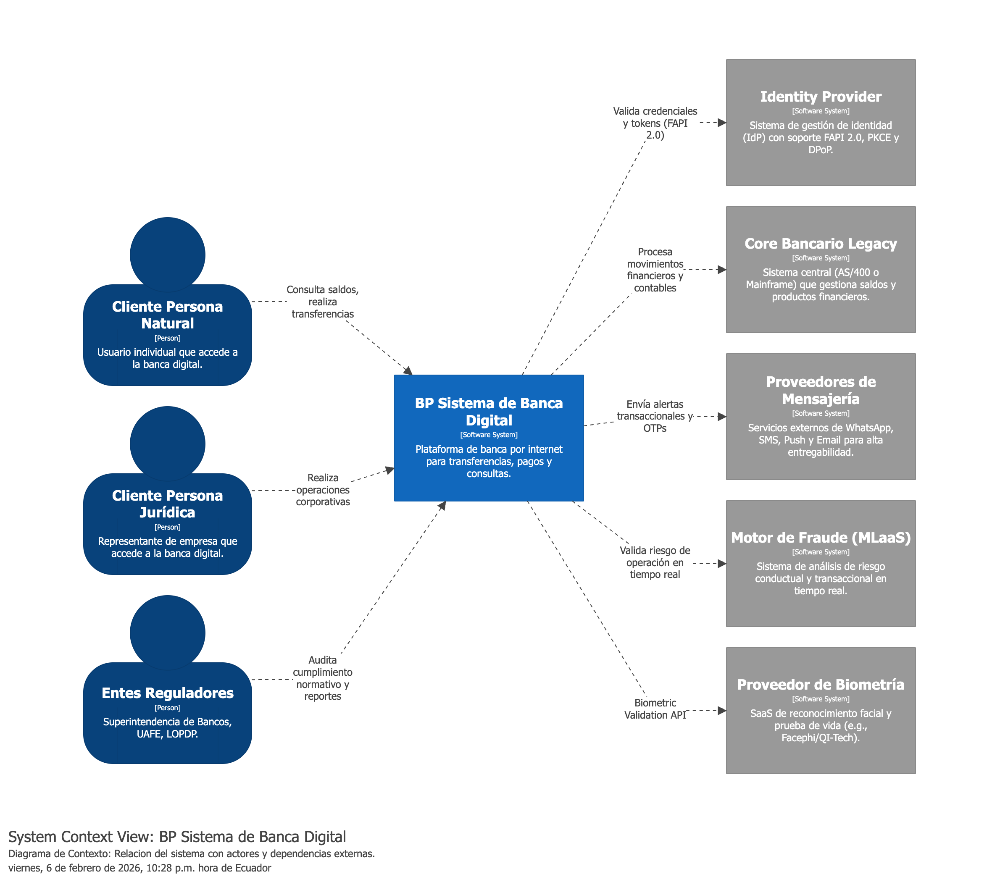
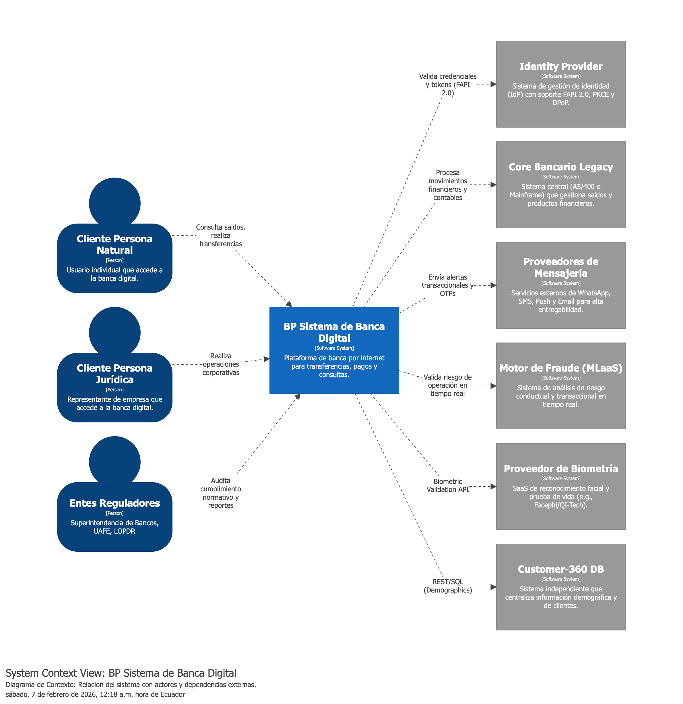
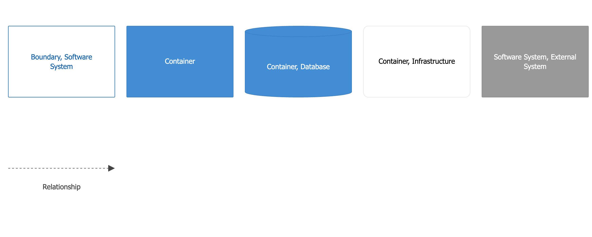
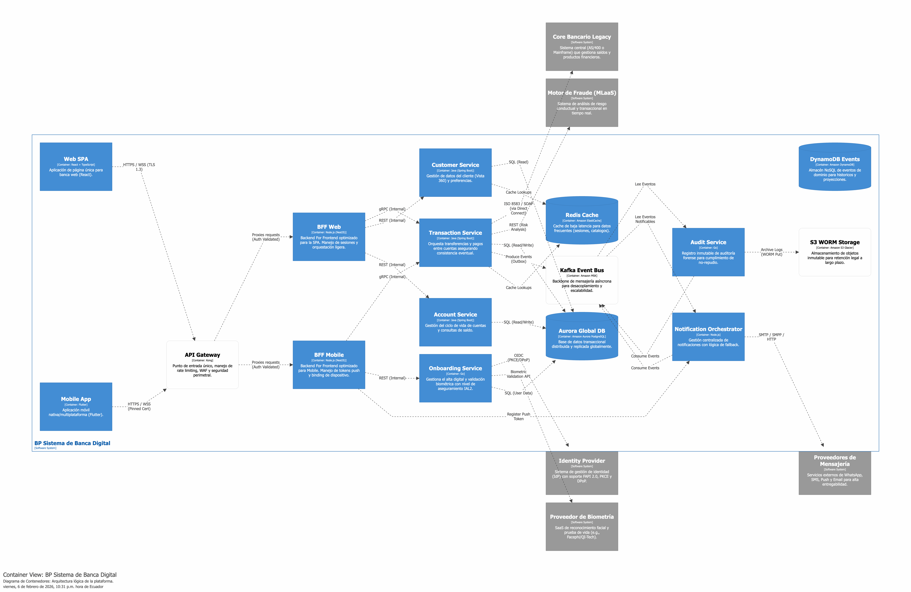
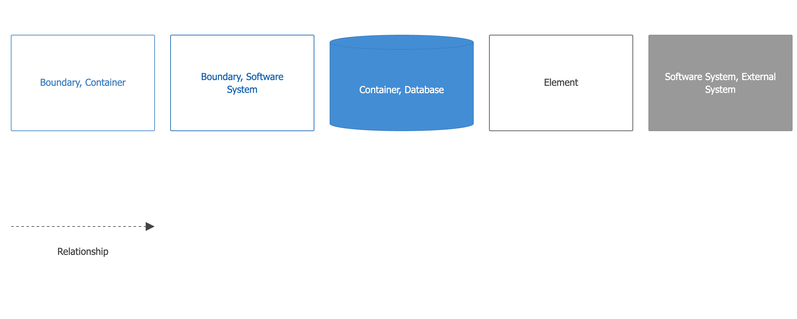
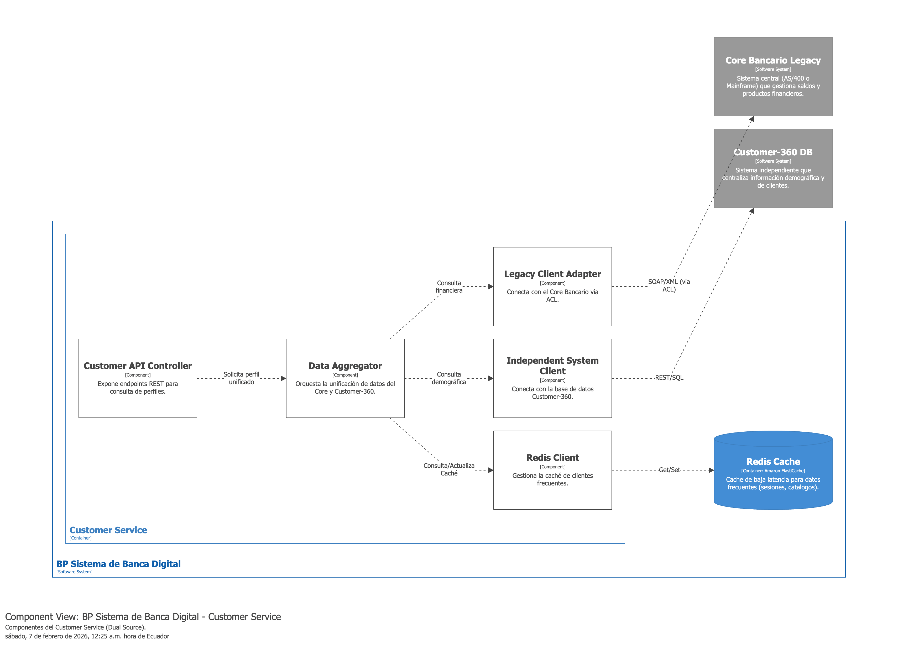
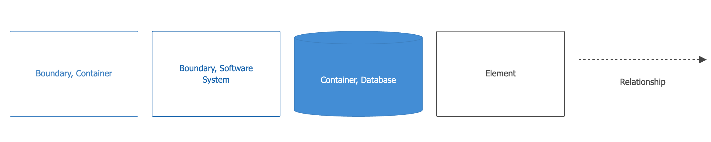
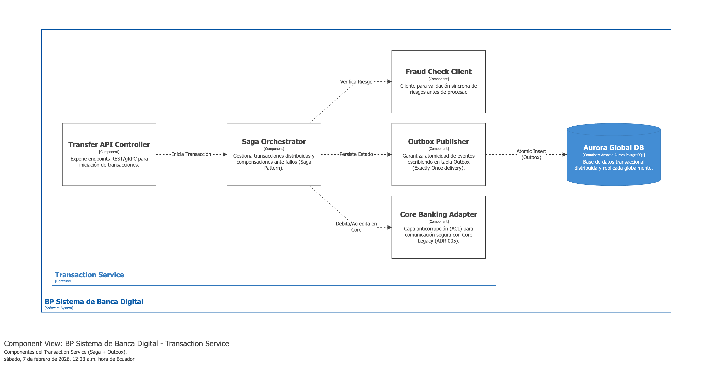
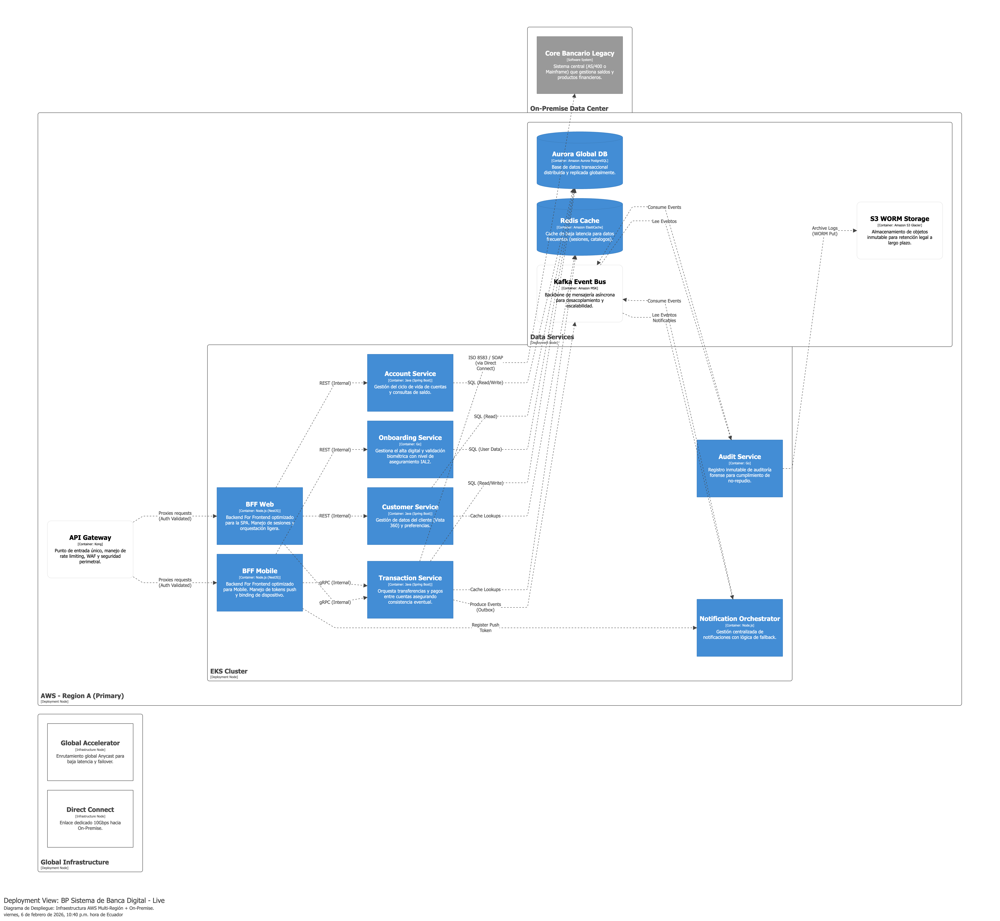
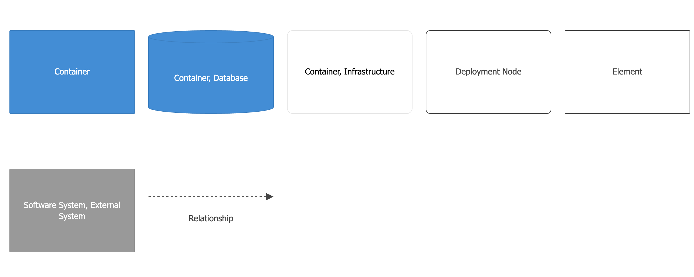

# Índice de Arquitectura C4

Este documento centraliza los artefactos visuales del sistema. La arquitectura fue modelada íntegramente utilizando **Structurizr (DSL)** para garantizar la consistencia entre niveles y representar fielmente la infraestructura real.

---

## Visualización de Alta Fidelidad (Niveles 1-4)

A diferencia de un diagrama estático, este modelo permite navegar por la jerarquía del sistema, desde la interacción con el usuario hasta el despliegue físico en la nube.

### 1. Nivel de Contexto del Sistema
Describe el ecosistema digital y los límites del sistema con entidades externas (Core Bancario, IdP, UAFE).

| Diagrama Principal | Leyenda (Key) | Progresión (Animación) |
| --- | --- | --- |
|  |  |  |

---

### 2. Nivel de Contenedores
Presenta el desacoplamiento de microservicios, el API Gateway y la estrategia de **Dual Source** de datos.

| Diagrama Principal | Leyenda (Key) | Progresión (Animación) |
| --- | --- | --- |
|  |  |  |

---

### 3. Nivel de Componentes
Detalle de la lógica interna de los servicios críticos.

#### Customer Service (Sincronización Dual Source)
| Diagrama | Leyenda | Progresión |
| --- | --- | --- |
|  |  |  |

#### Transaction Service (Saga Pattern)
| Diagrama | Leyenda | Animación |
| --- | --- | --- |
|  |  |  |

---

### 4. Nivel de Despliegue (AWS Multi-Región)
Infraestructura de Misión Crítica con replicación de datos y fail-over automatizado.

| Infraestructura AWS | Leyenda | Progresión |
| --- | --- | --- |
|  |  |  |

---

## Fuente de Verdad (C4 as Code)
El archivo fuente que genera todos estos artefactos es:
**[workspace.dsl](diagrams/structurizr/workspace.dsl)**

Para visualizarlo interactivamente, puede copiar su contenido en el [Structurizr Playground](https://playground.structurizr.com/).
